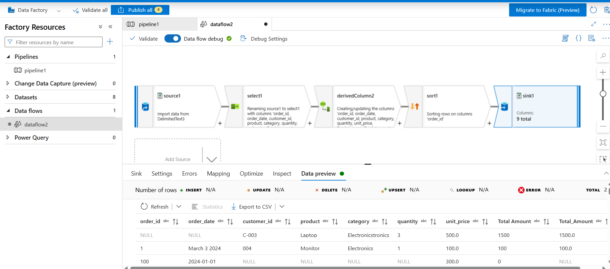
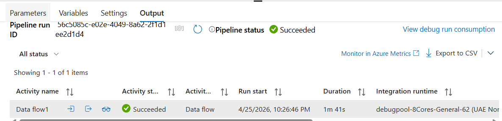
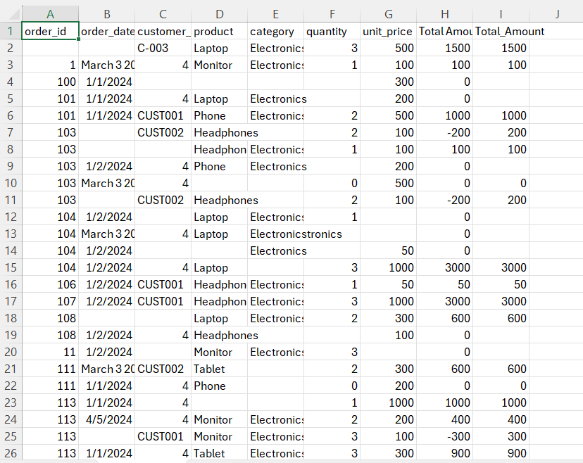

# Azure Data Factory: Sales Data ETL Pipeline

## Overview
This project demonstrates an End-to-End ETL (Extract, Transform, Load) pipeline built using **Azure Data Factory (ADF)**. The pipeline extracts raw, messy sales data from a CSV file, applies business logic and data cleansing transformations using a Mapping Data Flow, and loads the structured output into a target destination.

## Pipeline Architecture
1. **Source**: Ingests raw `sales.csv` data.
2. **Mapping Data Flow (Transformations)**:
   - **Filter**: Removes invalid records (e.g., dropping rows where `order_id` is null).
   - **Derived Column**: 
     - Casts data types to ensure consistency (String, Integer, Float).
     - Standardizes text fields (e.g., `customer_id` to uppercase, standardizing category names to `Electronics`).
     - Cleans numerical anomalies by converting negative quantities and prices to absolute values.
     - Calculates a new `Total_Amount` metric (`quantity * unit_price`).
   - **Sort**: Organizes the final dataset in ascending order by `order_id` for better readability.
3. **Sink**: Saves the transformed, clean data into a new dataset (`cleaned_sales.csv`).

## Visual Documentation

### 1. Mapping Data Flow Logic
This screenshot displays the transformation logic from source to sink.

### 2. Pipeline Execution
The successful execution of the pipeline trigger showing the data flow activity.

### 3. Cleaned Data Output
A preview of the final, formatted dataset.

## Repository Contents
- `sales.csv`: The original, unformatted raw data file.
- `cleaned_sales.csv`: The final processed and sorted output file.
- `README.md`: Project documentation.
